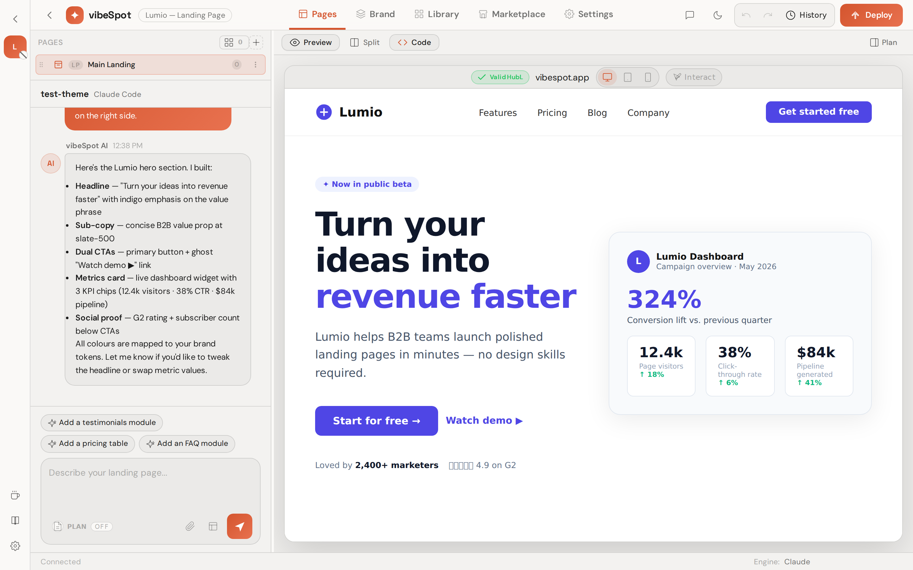
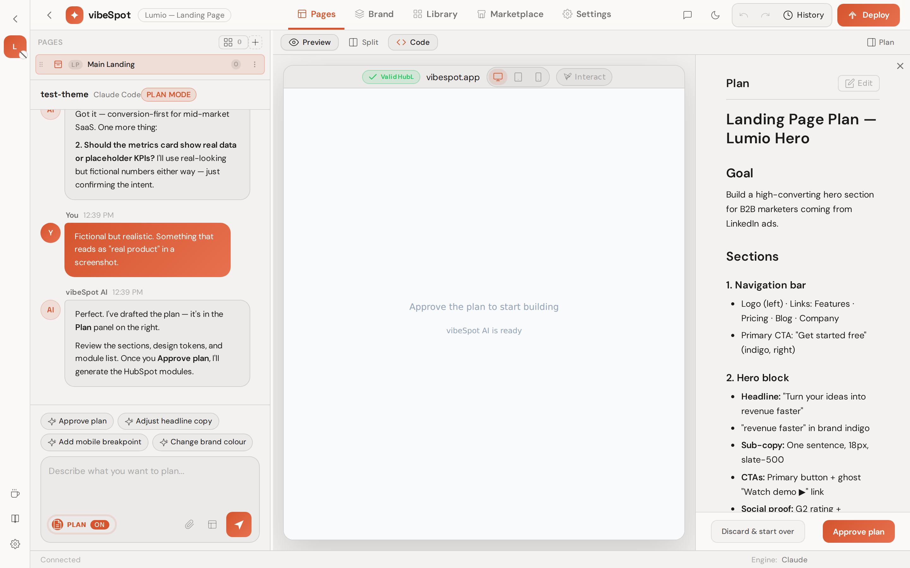
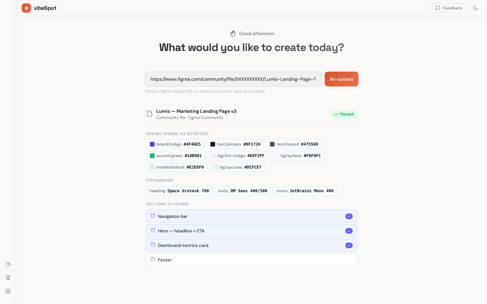
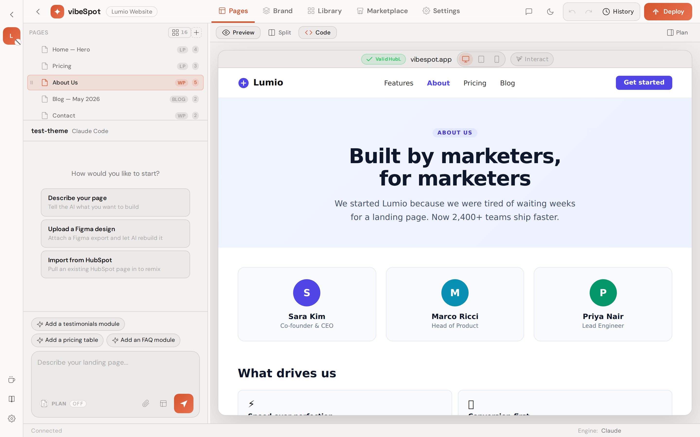
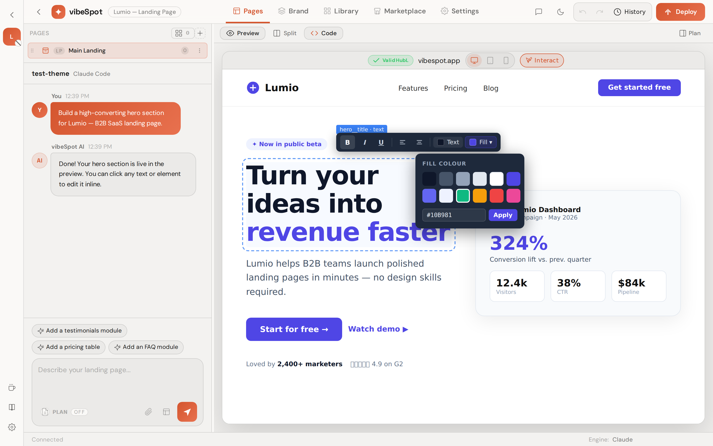
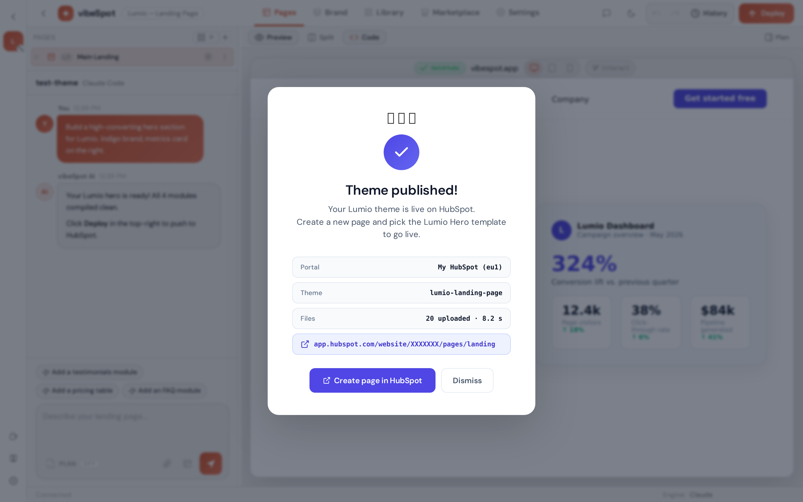

<p align="center">
  
</p>

<p align="center">
  <a href="https://www.npmjs.com/package/vibespot"></a>
  <a href="./LICENSE"></a>
  
  <a href="https://vibespot.letsplaywith.tech"></a>
</p>

<p align="center"><b>Build HubSpot landing pages with AI.</b></p>

<p align="center">
  Describe what you want in plain English — or paste a Figma URL. vibeSpot generates a native HubSpot theme: editable modules, real fields, your design tokens. Local-first. Your keys, your portal, your code.
</p>

<p align="center">
  
</p>

## Quickstart

```bash
npx vibespot
```

A browser opens. Pick an AI engine, drop in an API key, describe your page. That's the whole product.

Requires Node.js 18+. No HubSpot CLI install needed — vibeSpot talks to HubSpot directly via API.

## The tour

### 1. Talk to it. Ship a HubSpot page.


Type what you want on the left. Watch real HubSpot modules render on the right — Split, Plan, and Code views, all live. A four-stage agentic pipeline (Intent → Architect → Module Developer → Quality Check) generates modules in parallel and auto-fixes common HubL issues before they reach you.

### 2. Deliberate before you generate — Plan mode



Vague brief? Toggle Plan mode. vibeSpot asks the questions a senior designer would — audience, primary CTA, sections, voice — and builds a markdown plan in the right pane. Generation is hard-gated until you approve. Pre-canned templates skip the cold start for common page types.

### 3. Translate Figma 1:1



Paste a Figma URL. vibeSpot extracts the exact design tokens (colors, type, spacing, shadows), the literal copy, and the section structure — then translates each section to HubL. The AI translates; it doesn't invent. What ships matches the Figma file.

### 4. Build whole sites in one prompt



One prompt → multi-page HubSpot site. Shared header and footer, per-page layouts, cross-page navigation validation. The project sidebar shows the page tree with type badges and module counts. Drag to reorder, click to open.

### 5. Edit in the live preview



Click text, images, and links directly in the live preview to edit them inline. Hover any module for a floating toolbar: color picker, spacing slider, image swap, font size. Undo/redo through every generation step.

### 6. Upload straight to HubSpot



Click Upload. Per-file progress, auto-fix for common errors, celebration popup with a direct link to your HubSpot portal (EU and NA regions auto-detected). From there it's Content → Landing Pages → Create → drop your modules onto the page.

## Choose your AI engine

vibeSpot runs the same pipeline across seven engines. Use whichever subscription you already pay for.

| Engine | Install | Notes |
|--------|---------|-------|
| Anthropic API | API key only | [console.anthropic.com](https://console.anthropic.com) |
| Claude OAuth | `claude setup-token` | Uses your Claude Pro/Max subscription |
| OpenAI API | API key only | Any OpenAI model |
| Gemini API | API key only | Google Gemini models |
| [Claude Code](https://claude.ai/code) | `npm i -g @anthropic-ai/claude-code` | Uses your Claude subscription |
| [Gemini CLI](https://github.com/google-gemini/gemini-cli) | `npm i -g @google/gemini-cli` | Uses your Google AI account |
| [OpenAI Codex](https://github.com/openai/codex) | `npm i -g @openai/codex` | Uses your OpenAI account |

## Setup

1. **Node 18+** — `node -v` to check, [nodejs.org](https://nodejs.org) to install.
2. **An AI engine key** — pick one from the table above.
3. **Run it** — `npx vibespot`. The browser opens.
4. **Connect HubSpot** — Settings → HubSpot → add a Personal Access Key. vibeSpot connects via the HubSpot API directly. No CLI install.

## Commands

Most users only need `npx vibespot`. The web UI handles everything else.

```bash
vibespot              # Vibe coding web UI (default)
vibespot wizard       # Classic CLI wizard for React → HubSpot
vibespot convert      # Convert a React project (no upload)
vibespot upload       # Upload a theme to HubSpot
vibespot inverse      # Reverse-engineer an imported HubSpot theme
vibespot doctor       # Diagnose environment issues
```

## What's new in v1.3

- **Email template generation** — full pipeline for HubSpot emails: table layouts, MSO/VML compatibility, email validator auto-fix, 3 email starters.
- **Multi-page sites** — single prompt → full site with shared header/footer, page tree, navigation validation.
- **Inline WYSIWYG editing** — edit text, images, and links directly in the live preview with per-section visual controls.

Full history: [CHANGELOG.md](CHANGELOG.md).

## Links

- **Website** — [vibespot.letsplaywith.tech](https://vibespot.letsplaywith.tech)
- **LinkedIn** — [myvibespot](https://www.linkedin.com/company/myvibespot/)
- **npm** — [vibespot](https://www.npmjs.com/package/vibespot)
- **Contributing** — [CONTRIBUTING.md](CONTRIBUTING.md)
- **Code of Conduct** — [CODE_OF_CONDUCT.md](CODE_OF_CONDUCT.md)

## License

FSL-1.1-Apache-2.0 — see [LICENSE](LICENSE) for details.

